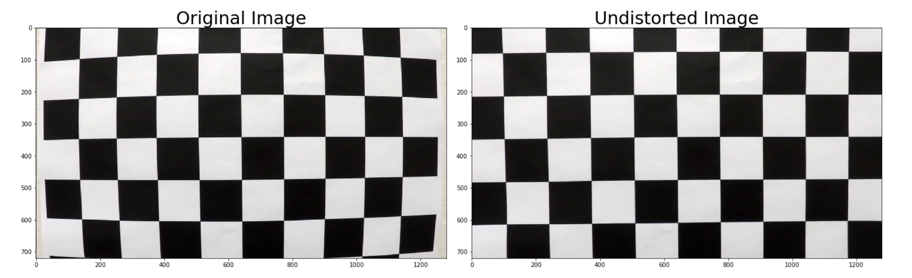
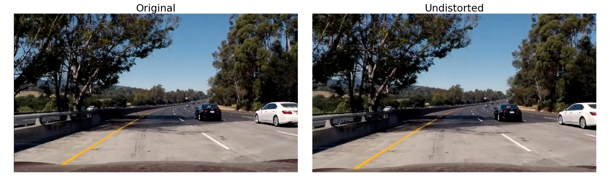
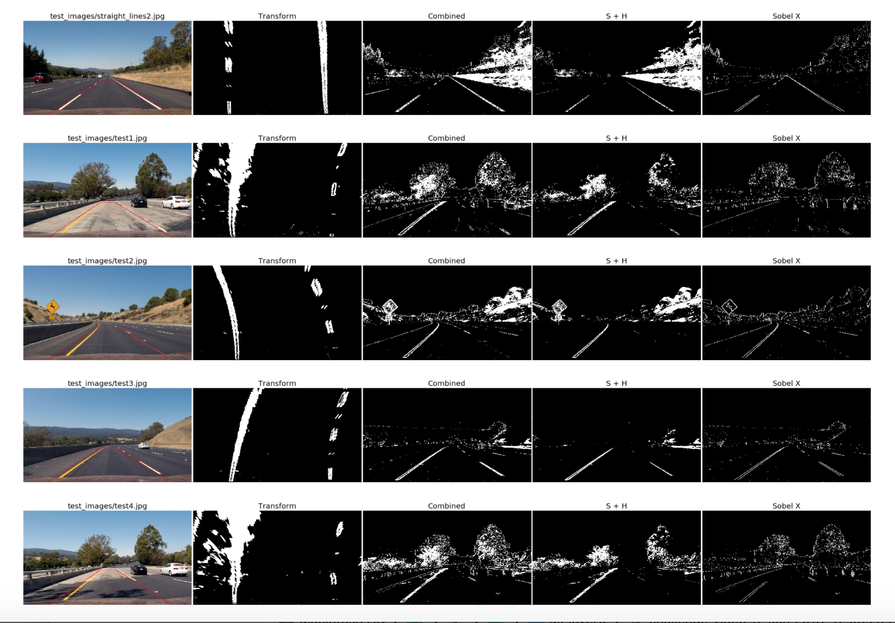
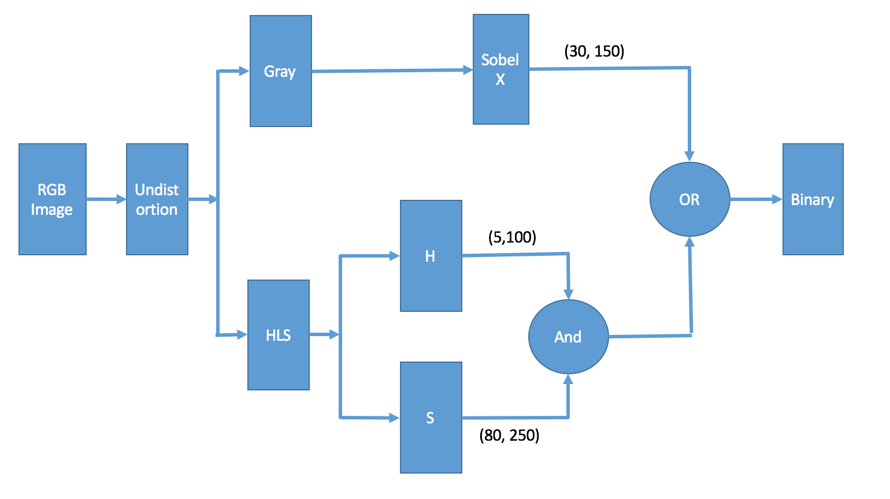
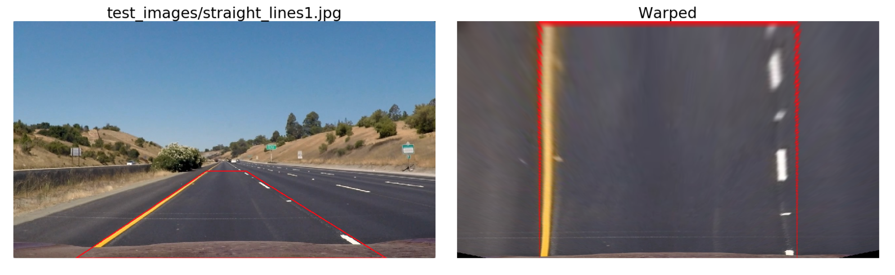
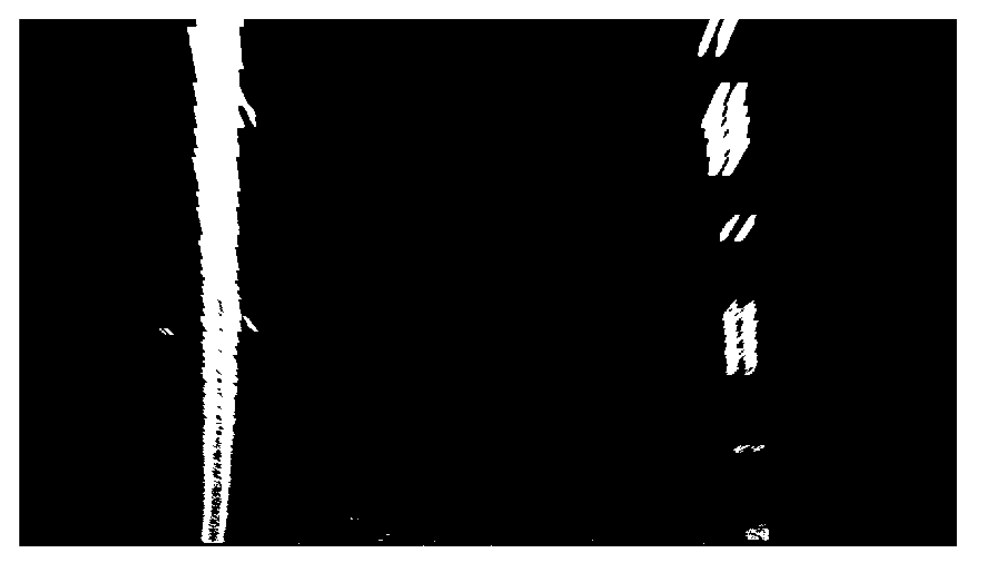
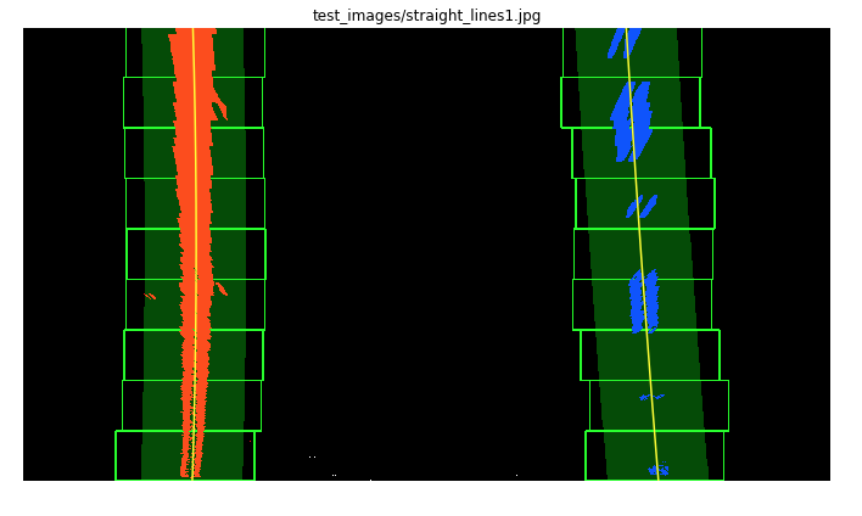
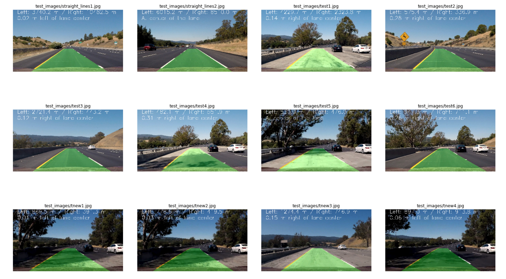

# Advanced Lane Lines

---

## Goal

**Advanced Lane Finding Project**

* Compute the camera calibration matrix and distortion coefficients given a set of chessboard images.
* Apply a distortion correction to raw images.
* Use color transforms, gradients, etc., to create a thresholded binary image.
* Apply a perspective transform to rectify binary image ("birds-eye view").
* Detect lane pixels and fit to find the lane boundary.
* Determine the curvature of the lane and vehicle position with respect to center.
* Warp the detected lane boundaries back onto the original image.
* Output visual display of the lane boundaries and numerical estimation of lane curvature and vehicle position.


## [Rubric](https://review.udacity.com/#!/rubrics/571/view) Points

**Here I will consider the rubric points individually and describe how I addressed each point in my implementation.**

---

### I. Writeup

#### 1. Provide a Writeup / README that includes all the rubric points and how you addressed each one.  You can submit your writeup as markdown or pdf.  [Here](https://github.com/udacity/CarND-Advanced-Lane-Lines/blob/master/writeup_template.md) is a template writeup for this project you can use as a guide and a starting point.  

You're reading it!

---

### II. Camera Calibration

#### 1. Briefly state how you computed the camera matrix and distortion coefficients. Provide an example of a distortion corrected calibration image.

The code for this step is contained in the first code cell of the IPython notebook located in `camera_cal.ipynb`.  

I start by preparing "object points", which will be the (x, y, z) coordinates of the chessboard corners in the world. Here I am assuming the chessboard is fixed on the (x, y) plane at z=0, such that the object points are the same for each calibration image.  Thus, `objp` is just a replicated array of coordinates, and `objpoints` will be appended with a copy of it every time I successfully detect all chessboard corners in a test image.  `imgpoints` will be appended with the (x, y) pixel position of each of the corners in the image plane with each successful chessboard detection (using `cv2.findChessboardCorners`).  

I then used the output `objpoints` and `imgpoints` to compute the camera calibration and distortion coefficients using the `cv2.calibrateCamera()` function.  I applied this distortion correction to the test image using the `cv2.undistort()` function and obtained this result: 



And I saved the `mtx` and `dist` (from `cv2.calibrateCamera()`) to `camera_calibration.p` for future use.

### III. Pipeline (single images)

#### 1. Provide an example of a distortion-corrected image.

I firstly load the two values: `mtx` and `dist`, from `camera_calibration.p`, then I applied `cv2.undistort()` function to the test image and I got the results as follows:



You can compare the hood of the car in the two images.

#### 2. Describe how (and identify where in your code) you used color transforms, gradients or other methods to create a thresholded binary image.  Provide an example of a binary image result.

I used a combination of color and gradient thresholds to generate a binary image (`LaneFinding.ipynb`).  Here's an example of my output for this step.  



And the color space and thresholds I used is as follows:



The reason I used **both S and H channels** is: using S channel to find the lines under different situations, and with H channel to eliminate the noise caused by the shadow on the road. 

#### 3. Describe how (and identify where in your code) you performed a perspective transform and provide an example of a transformed image.

The code for my perspective transform includes a function called `perspective_transform()`, which is in the 9th code cell of the `LaneFinding.ipynb`.  The `perspective_transform()` function takes as inputs an image (`img`), as well as transform matrix (`M`), then use `cv2.warpPerspective()` to do the transform.

To get the `M`, I need source (`src`) and destination (`dst`) points.  I chose the hardcode the source and destination points in the following manner:

```python
def get_region_of_interest():
    bottomY = 720
    topY = 455
    left1 = (190, bottomY)
    left2 = (585, topY)
    right1 = (705, topY)
    right2 = (1130, bottomY)
    return np.float32((left2,right1,right2,left1)) 

def get_transform_dest(w,h):
    offset = 250
    dst = np.float32(
    		[[offset, 0],
    		[w-offset, 0],
    		[w-offset, h], 
    		[offset, h]])
    return dst

def get_transform_matrix(src_pts,dest_pts):
    M = cv2.getPerspectiveTransform(src_pts, dest_pts)    
    return M    

w,h = sample_image.shape[1::-1]
src = get_region_of_interest()
dst = get_transform_dest(w,h)
M = get_transform_matrix(src,dst)
inverseM = get_transform_matrix(dst,src)
```


This resulted in the following source and destination points:

| Source        | Destination   | 
|:-------------:|:-------------:| 
| 585, 455      | 250, 0        | 
| 705, 455      | 1030, 0      |
| 1130, 720     | 1030, 720      |
| 190, 720      | 250, 720        |

I verified that my perspective transform was working as expected by drawing the `src` and `dst` points onto a test image and its warped counterpart to verify that the lines appear parallel in the warped image.



#### 4. Describe how (and identify where in your code) you identified lane-line pixels and fit their positions with a polynomial?

First I applied the perspective transform to the binary image (got from color and gradient thresholding), and I got result as follows:



Then I use the "sliding window" technique (the 20th and 21st cell in `LaneFinding.ipynb`) introduced in the lecture to find the nonzero pixels belong to the lane lines. The pixels are shown as the RED and BLUE dots in the following image. Then with `np.polyfit()` to find the polynomial coefficients. The lines are shown as YELLOW.

Once found the polynomial, I use that to find the pixels in the next frame (instead of using "sliding window"). It works pretty well for the "project video", but for more challenging videos, it needs to be more sophisticated.



#### 5. Describe how (and identify where in your code) you calculated the radius of curvature of the lane and the position of the vehicle with respect to center.

I did this the 22nd cell in `LaneFinding.ipynb` using the method as in the lecture.

#### 6. Provide an example image of your result plotted back down onto the road such that the lane area is identified clearly.

I implemented this step in 24th cell in `LaneFinding.ipynb`. It shows that the model works well in straight road, curvy road, bright road and shadow road. 



---

### IV. Pipeline (video)

#### 1. Provide a link to your final video output.  Your pipeline should perform reasonably well on the entire project video (wobbly lines are ok but no catastrophic failures that would cause the car to drive off the road!).

Here's a [my video](./out_project_video.mp4)

---

### V. Discussion

#### 1. Briefly discuss any problems / issues you faced in your implementation of this project.  Where will your pipeline likely fail?  What could you do to make it more robust?

When I look back, I think the most 2 challenging parts in this project are:

* The shadow in the road might confuse the model when identifying which pixels in binary image might belong to the lines.
* The curvy road might cause the "jittery" or "jumps" from frame to frame.

I specifically did the following 2 things:

*  After a lot of experiments of color and gradient thresholding, I decided to include the H channel (of HLS), with threshold (5,100), it effectively reduce the affect of the hard shadow. S channel alone couldn't eliminate the shadow because the hard shadow is pretty dark (meaning the saturation is high), so S couldn't tell the shadow pixel from the line pixel.
*  I only use "sliding window" in the first frame, then I reuse the polynomial fit to find the potential pixels in the next frame. Luckily, the project video starts with lines not very curvy, "sliding window" did a pretty good job, then the polynomial fit also did good job, and so on.

My method will likely fail when:

* The color and gradient thresholding I chose is not very robust in other 2 videos. It couldn't find enough pixels of lines (meanwhile eliminating other pixels), it makes very difficult to make the proper polynomial fit. I need to explore more options of color and other thresholdings.
* When the road is very curvy and/or sloping as some frames in the other 2 videos. The perspective transform I used in the code is assuming the road is flat, so that will cause the model to fail. And I found the left line polynomial fit and right line polynomial fit separately, and didn't do any sanity check. Taking the advantage of the fact that the two lines are in parallel no matter straight or curvy will make the method much more robust.


